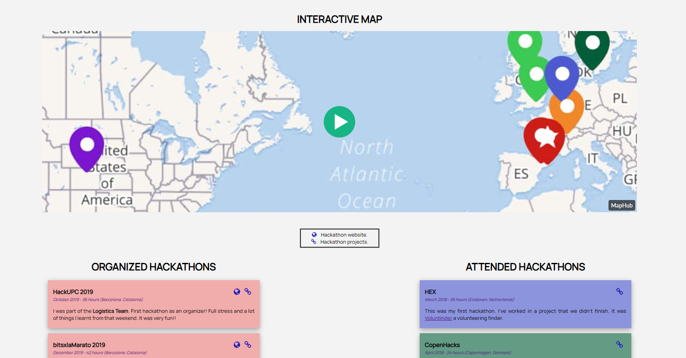

# Carlota's Hackathons

In this [website](https://myhacks.carlotacb.dev/) you will find all the hackathons I attended and organized during my student life.

## Interactive section

The map has been developed using the program [MapHub](https://maphub.net/) where you add pointers to a map and later on you can embed the map on your website.

## Hackathon description

I've used HTML and CSS without any framework to create basic cards, the cards have the background color that go with the pointer color in the map. For every hackathon there are the following information:
* Hackathon name.
* Date, Duration and Place.
* Description:
  - For the organized ones: Description on the rol I have.
  - For the attended ones: Description on the project developed.
* 🌎 Link to the hackathon webpage.
* 🔗 Link to all hackathon presented projects.
